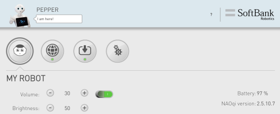
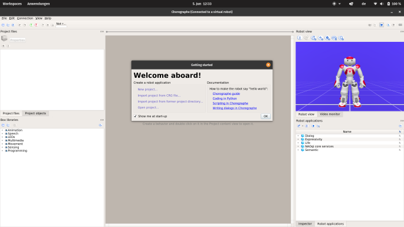
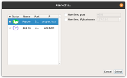
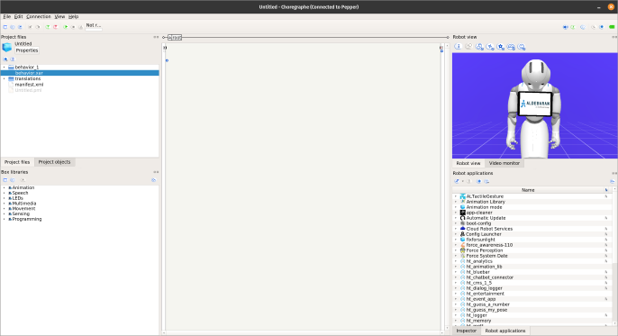
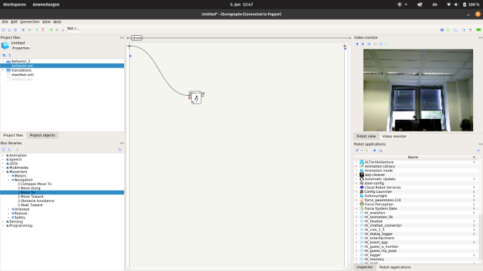

# Pepper via Python

Setup and interaction basics for controlling a SoftBank Robotics Pepper robot
from Python.

> **Looking for the voice games?** See the main **[`README.md`](README.md)** for the
> Parrot, "Ask Pepper" Q&A, and Guess What games, the tablet touch menu
> (kiosk), and the web admin panel (`pepper_admin.py`). This file only covers
> environment setup and basic Pepper interaction.

## Setup

### Network
Pepper won't join eduroam or similar managed WiFi - it needs its own
network. It's configured to auto-join any network named `Pepper` (ask a lab
member for the password), created via phone hotspot, laptop hotspot, or
router - just make sure only one such network is in range.

Note: not every laptop can host a hotspot and stay online at the same time.
HCTL's Schenker laptops can, under Windows 10/11. On Linux, use
[`linux-wifi-hotspot`](https://github.com/lakinduakash/linux-wifi-hotspot) to
run both simultaneously.

Once connected to the same network, Pepper is reachable by IP over browser or
SSH (user `nao`, same password as the WiFi):



### Choregraphe
Aldebaran's official GUI tool for controlling Pepper (camera access, drag-and-drop
motion pipelines). Setup files are in `choregraphe/` (not included in this
repo - download separately, see below). Connect via the green `Connect to...`
button and pick `Pepper`:






### Python environment
Pepper's SDK only works with Python 2.7 (32-bit).

```bash
conda env create -f environment.yml
conda activate pepper
```

Manual setup on Windows:
```powershell
conda create -n pepper
conda activate pepper
conda config --env --set subdir win-32
conda install python=2.7
```
Verify with `python -c "import struct; print(struct.calcsize('P') * 8)"` -
should print `32`.

On Linux: `conda create -n pepper python=2.7`.

Either way, download the pynaoqi SDK (Python 2.7, matching your OS) from
SoftBank/Aldebaran, unpack it, and add its `lib` folder to `PYTHONPATH`
(Windows: env var; Linux: `export PYTHONPATH=$PYTHONPATH:/path/to/lib` or add
to `.bashrc`).

Check it worked:
```python
import naoqi
import qi
```
One of the two importing without error is enough.

Notes:
- `naoqi` (`ALProxy`) and `qi` (`session.service(...)`) are close to
  interchangeable for most calls.
- Jupyter can be finicky to install on Python 2.7 - try
  `conda install -c conda-forge jupyterlab` or `pip install jupyterlab`.
- The [NAO⁶ SDK](https://www.aldebaran.com/en/support/nao-6/downloads-softwares)
  also works with Pepper and doesn't require 32-bit Python, if you'd rather
  use that.

## Basic interaction
`pepper_basic_interaction.ipynb` walks through showing an image/webpage/video
on the tablet, text-to-speech, and downloading a file from Pepper over SFTP.

Tips:
- Files shown on the tablet must live under
  `/home/nao/.local/share/PackageManager/apps/robot-page/html/`, served at
  `http://198.18.0.1/` from the tablet's perspective. Reach that folder via
  SSH/SFTP (e.g. FileZilla, MobaXterm).
- Pepper's onboard processor is weak - do any heavy lifting (video
  compression, etc.) on your computer first.
- Some libraries (e.g. speech/vision APIs) only work well in Python 3; you
  may need a separate Python 3 environment alongside the Python 2.7 one.

### File transfer
Use `paramiko` (`pip install paramiko`) for SFTP to/from Pepper. Reuse one
SSH/SFTP connection instead of reconnecting per file - it's slow to set up.
See the file-transfer cell in `pepper_basic_interaction.ipynb` for a minimal
example, or `pepper_echo.py` for the full version used by the games.

### Voice interaction (speech-to-text / chat)
The pattern used by all the games in this repo: record audio on Pepper ->
pull the file over SFTP -> transcribe with a speech-to-text API -> send the
transcript to a chat API -> speak the reply back with Pepper's TTS. Done with
plain `requests` calls since Python 2.7 doesn't play well with most modern API
client libraries. See [`README.md`](README.md) and `pepper_echo.py` for the
actual implementation.

Pepper's built-in TTS voice is robotic and has no real intonation - swapping
in an external TTS API and playing the resulting audio file sounds much
better, at the cost of some latency.

## Resources
- http://doc.aldebaran.com/2-5/naoqi/
- http://doc.aldebaran.com/2-4/naoqi/
- https://cloud.aldebaran-robotics.com/
- https://www.aldebaran.com/en/support/pepper-naoqi-2-9/downloads-softwares
- https://www.aldebaran.com/en/support/nao-6/downloads-softwares
- http://doc.aldebaran.com/2-5/dev/python/install_guide.html
